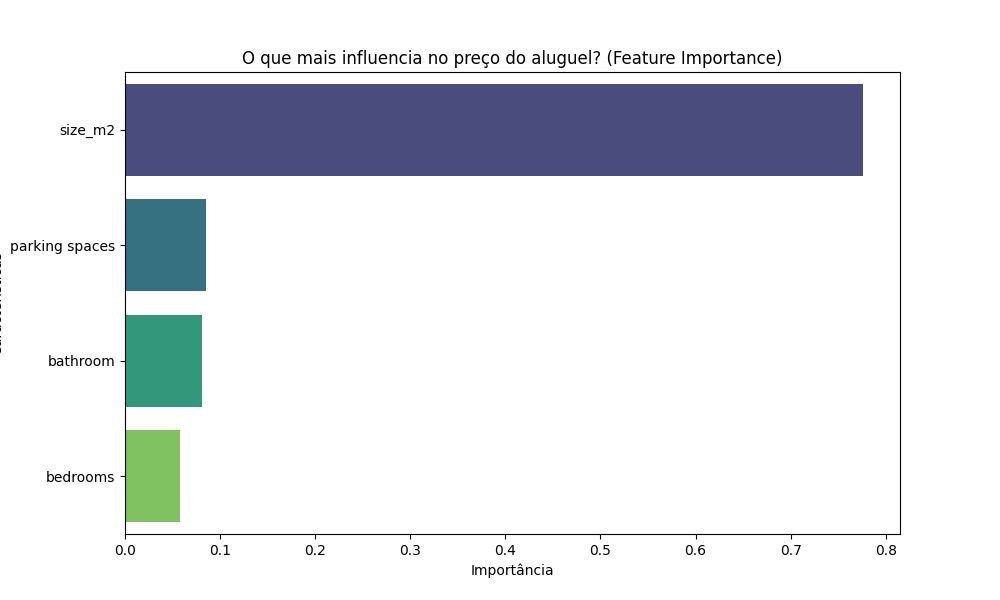

# 🏠 Real Estate Price Predictor (Brazil)

A Machine Learning web application to predict rental prices in São Paulo, Brazil, using real estate market data.


## 🧠 About the Project
This project moved from a simple linear regression prototype to a robust **Random Forest** model trained on real-world data.

**Key Features:**
* **Real Dataset:** Trained on the [Brazilian Houses to Rent Dataset](https://www.kaggle.com/datasets/rubenssjr/brasilian-houses-to-rent) (Kaggle), specifically filtered for São Paulo.
* **Algorithm:** Uses **Random Forest Regressor** to handle non-linear relationships and outliers.
* **Interactive App:** Built with **Streamlit** for real-time predictions.
* **Data Cleaning:** Implements strict filtering logic to remove outliers (e.g., inconsistent square footage or unrealistic prices).

## 🧠 Model Decision: Why Random Forest?

During the development, I initially considered **Linear Regression** (standard for introductory courses). However, real-world real estate data is chaotic and non-linear. I chose **Random Forest** for three main reasons:

1.  **Handling Non-Linearity:** Property prices don't always follow a straight line (e.g., a 200m² apartment isn't necessarily double the price of a 100m² one due to location and luxury factors). Random Forest captures these complex curves better than a simple linear line.
2.  **Robustness to Outliers:** The dataset contains luxury properties with very high rents. Linear Regression tries to "fit" these extreme values, often ruining the accuracy for regular apartments. Random Forest isolates these outliers, keeping the prediction stable for the majority of users.
3.  **Higher Accuracy:** In comparative tests, the Decision Tree ensemble (Random Forest) significantly outperformed Linear Regression in $R^2$ score for this specific dataset.

## 📊 Model Performance
The model takes into account:
* Size ($m^2$)
* Number of Bedrooms
* Number of Bathrooms
* Parking Spaces


## 📊 Data Insights
What drives rental prices in São Paulo? According to the model, **Size ($m^2$)** is the most dominant factor.




## 🚀 How to Run Locally

1.  **Clone the repository:**
    ```bash
    git clone [https://github.com/CaioAllvs/house-price-predictor-ml.git](https://github.com/CaioAllvs/house-price-predictor-ml.git)
    ```
2.  **Install dependencies:**
    ```bash
    pip install -r requirements.txt
    ```
3.  **Train the Model (Optional):**
    *If you want to retrain with the latest data:*
    ```bash
    python train_model.py
    ```
4.  **Run the App:**
    ```bash
    streamlit run app.py
    ```

## 🛠 Stack
* Python
* Pandas (Data Engineering)
* Scikit-Learn (Machine Learning)
* Streamlit (Web Framework)

---
Developed by Caio Alves
